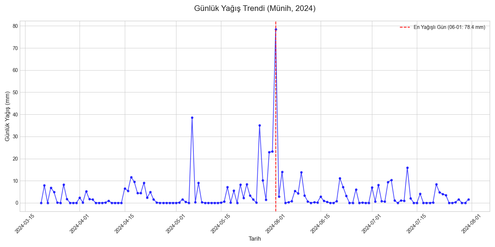
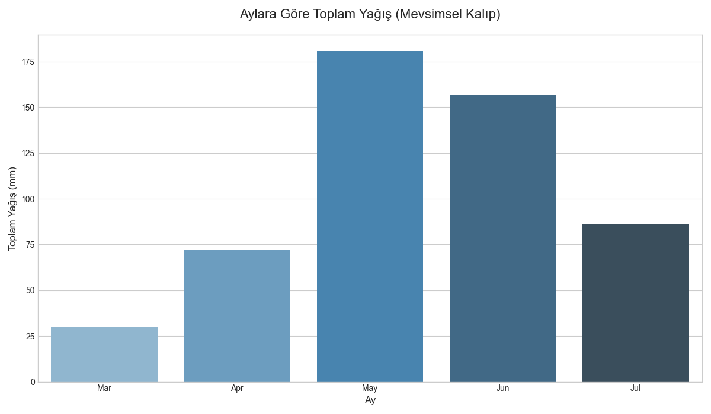

# ☀️ Proje 2: Hava Durumu Veri Analizi

Bu proje, Münih (München) şehrine ait Mart-Temmuz 2024 dönemi günlük hava durumu verilerini (`munich.csv`) analiz ederek, kısa vadeli mevsimsel kalıpları ve aykırı hava olaylarını incelemeyi amaçlamaktadır.

## 🎯 Amaç

Analiz sonucunda aşağıdaki temel sorulara yanıt verilmiştir:
* Veri setindeki analiz periyodu nedir?
* Dönem boyunca en yoğun yağış (aykırı olay) hangi gün yaşanmıştır?
* Aylara göre yağış dağılımı (mevsimsel kalıp) nasıldır?

## 🛠️ Kullanılan Teknolojiler

* **Python 3**
* **Pandas:** Veri manipülasyonu, temizleme ve analiz
* **Numpy:** Sayısal hesaplamalar
* **Matplotlib & Seaborn:** Veri görselleştirme

## 📈 Analizden Çıkan Sonuçlar

Analiz, 20 Mart 2024 ile 31 Temmuz 2024 arasındaki **134 günlük** veriyi kapsamaktadır.

### 1. Aykırı Hava Olayı (En Yağışlı Gün)

* Analiz edilen dönemdeki en yoğun yağış, **1 Haziran 2024** tarihinde **78.4 mm** olarak kaydedilmiştir.
* Bu aykırı olay, aşağıdaki günlük trend grafiğinde kırmızı çizgi ile işaretlenmiştir.



### 2. Mevsimsel Kalıp (Aylık Yağış)

* Veri seti, yağışların özellikle **Mayıs (180.6 mm)** ve **Haziran (157.0 mm)** aylarında yoğunlaştığını göstermektedir.
* Bu durum, bahar sonu ve yaz başı aylarının, analiz edilen dönemdeki en yağışlı zamanlar olduğunu ortaya koymaktadır.



## 📝 Nihai Analiz Raporu

Tüm bulguların, toplam yağış (526.10 mm) ve toplam kar (2.49 cm) gibi detaylı özetlerin yer aldığı metin raporuna **`hava_durumu_raporu.txt`** dosyasından ulaşabilirsiniz.

## 🚀 Projeyi Çalıştırma

Bu projeyi kendi bilgisayarınızda çalıştırmak ve çıktıları yeniden oluşturmak için:

1.  Bu depoyu klonlayın veya indirin.
2.  Veri seti (`munich.csv`) zaten deponun içindedir.
3.  Gerekli kütüphaneleri yükleyin:
    ```bash
    pip install pandas numpy matplotlib seaborn
    ```
4.  `analiz_havadurumu.py` dosyasını çalıştırın:
    ```bash
    python analiz_havadurumu.py
    ```
Kod çalıştığında, `hava_durumu_raporu.txt` metin dosyasını ve `.png` uzantılı grafikleri yeniden oluşturacaktır.
